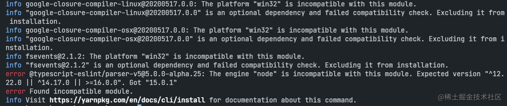
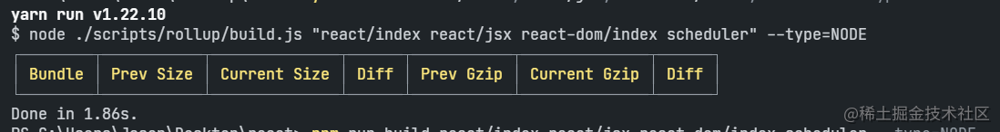
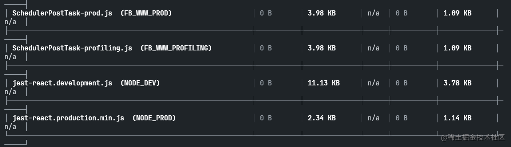
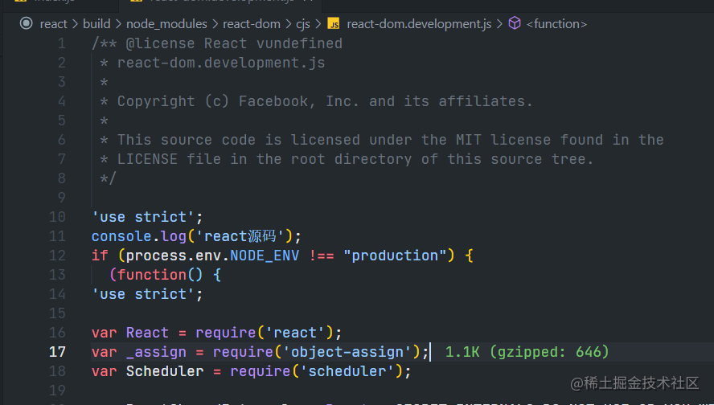
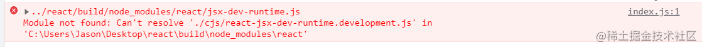
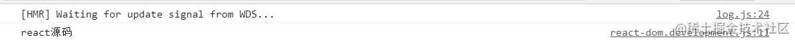

# 调试源码环境

---

## 前言

学习 React 源码的时候，该如何调试是一个头疼的问题，那么如何调试，下面娓娓道来。本文以下内容调试时间与文章发布时间一致，调试版本为 v17.0.2，过程中遇到的问题，会在下面说明。

<!--truncate-->

## 拉去源码

首先需要拉取 React 代码

```
# 拉取/克隆代码
git clone <https://github.com/facebook/react.git>

# 网络环境不好，拉取速度慢，可以选择下面2个方案：

# 1. 使用 cpm 代理
git clone <https://github.com.cnpmjs.org/facebook/react>

# 2. 或者通过码云国内环境下载
git clone <https://gitee.com/mirrors/react.git>

```

拉取成功后，安装依赖

```
# 进入 react 源码文件夹
cd react

# 安装依赖
yarn

```

在安装依赖过程中，可能会遇到安装失败情况，比如我遇到的：



解决方案：

修复 node 版本不兼容的命令配置，忽略引擎版本检查。

```
yarn config set ignore-engines true

```

再从新 `yarn`即可。

## 打包源码

需要打包 `react`、`scheduler`、`react-dom`三个包，为 dev 环境可以使用的 cjs 包。

```
# 执行打包命令
yarn build react/index,react/jsx,react-dom/index,scheduler --type=NODE

```

执行 `yarn build` 可能会出现下面打包不成功的问题。



解决办法就是 尝试使用 `npm` 打包就能打包成功。

```
npm run build react/index,react/jsx,react-dom/index,scheduler --type=NODE

```

打包成功效果图：



然后进入源码目录 `build/node_modules` 会生成最新的打包的代码。我们为 `react`、`react-dom`创建 `yarn link`。

> 通过 yarn link 可以改变项目中依赖包的目录指向

```
cd build/node_moudles
# 分别进入 react、react-dom文件下执行 yarn link
cd react
yarn link
cd ..
cd react-dom
yarn link

```

## 创建一个调试项目

```
# 使用 create-react-app 创建一个 react 应用
npx create-react-app react-origin-code

cd react-origin-code

# 在创建好的项目中，将 react、react-dom 2个包 指向我们刚才生成的包
yarn link react react-dom

```

我们可以试试在 `react/build/node_modules/react-dom/cjs/react-dom.development.js`文件中打印看看是否成功：



然后 `yarn start` 启动项目。

可能启动项目之后页面会报错。



解决方案：

复制 `react/fixtures/legacy-jsx-runtimes/react-17/cjs/react-jsx-dev-runtime.development.js`文件到我们打包好的 `build`文件夹 `build/node_modules/react/cjs`下面即可，再从新 `yarn start`。

最终看看控制台我们在 `react-dom.development.js`文件中添加的 `console.log`



## 最后

打印成功，妥，可以开始调试了！
