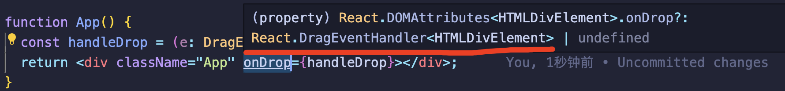
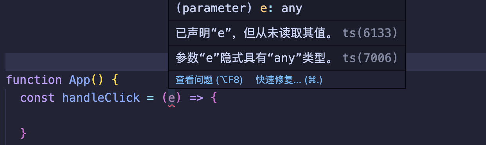

## 开头

现在 TypeScript 的发展也越来越成熟，已逐渐应用到我们开发的前端项目之中，它能够带来类型提示，提前规避类型上的错误，来提高项目代码的健壮性，以及更高效的编码效率，前提就是我们需要定义好相应的类型，才能更好的拥有代码上的类型提示。

记得在 React 项目中刚使用 ts 的时候，遇到事件的 Event Handler 中的 `e` 不知道它怎么去定义，现在来从新盘点一下 React TS 中的 Event Handler 。

就比如下面没有给它定义类型，TS 编译器就会提示错误：



<!--truncate-->

开始 开始 ！！

### `onCLick` 事件

这个是最常用的一个事件名称，这里没什么好说的，它的 `event` 类型也比较少需要去特殊定义，但是可以了解一下，它的类型为：`React.MouseEvent<T>` ，它并且接收一个泛型，也就是元素类型。

**所有的事件类型都接收一个泛型。**

```tsx
import { MouseEvent } from "react";

function App() {
  const handleClick = (e: MouseEvent<HTMLButtonElement>) => {};
  return (
    <div className="App">
      <button onClick={handleClick}>onClick</button>
    </div>
  );
}
```

注意：`MouseEvent` 不是自带的，而是需要从 react 库中引入，因为 react 内部自己写了一套合成事件系统。简单说一下，本质上在元素上定义 onClick 不会通过 `addEevntListener` 绑定到当前元素上，而是绑定在根元素 app 上，通过事件机制来执行，减少浏览器内存，也是 react 做的一个优化点，也更好控制内部应用所有的事件。

`〈HTMLButtonElement〉` 如果是 div 过着其他的 元素就将 Button 替换成 `HTMLDivElement` 即可。

### `onChange` 事件

记得刚上手 TS 项目中写表单，第一个就查的它的 event 什么类型，它的类型就是：`React.ChangeEvent<HTMLInputElement>`

```tsx
import { ChangeEvent } from "react";

function App() {
  const handleChange = (e: ChangeEvent<HTMLInputElement>) => {
    console.log(e.target.value);
  };
  return (
    <div className="App">
      <input placeholder="TS Event Handler" onChange={handleChange} />
    </div>
  );
}
```

### `onKeyDown` 事件

键盘事件，也是逃不过的回车事件方法调用。它的类型的为：`React.KeyboardEvent<HTMLInputElement>`

```tsx
import { KeyboardEvent } from "react";

function App() {
  const handleKeyDown = (e: KeyboardEvent<HTMLInputElement>) => {
    if (e.keyCode === 13) {
      console.log("回车了");
    }
  };
  return (
    <div className="App">
      <input placeholder="TS Event Handler" onKeyDown={handleKeyDown} />
    </div>
  );
}
```

### `onSubmit` 事件

表单提交事件类型，它的类型的为：`React.FormEvent<HTMLFormElement>`

```tsx
import { FormEvent } from "react";

function App() {
  const handleSubmit = (e: FormEvent<HTMLFormElement>) => {};
  return (
    <div className="App">
      <form onSubmit={handleSubmit}></form>
    </div>
  );
}
```

### `onDrop` 拖拽事件

我遇到使用的地方就是拖拽文件上传，还有就是拖拽内容更改位置。它的事件类型为：`React.DragEvent<HTMLElement>`

```tsx
import { DragEvent } from "react";

function App() {
  const handleDrop = (e: DragEvent<HTMLElement>) => {};
  return <div className="App" onDrop={handleDrop}></div>;
}
```

### 遇到新的 Event 那么类型怎么查看？

这里直接鼠标 hover 到事件名上，TS 编译器就会提示出来，比如下面 👇：



此时就知道 event 类型就是 `React.DragEvent<HTMLDivElement>` 了，去掉后面 Handler 即可。

往后就不用像刚开始接触 React + TS 项目的时候去一个个查了。
