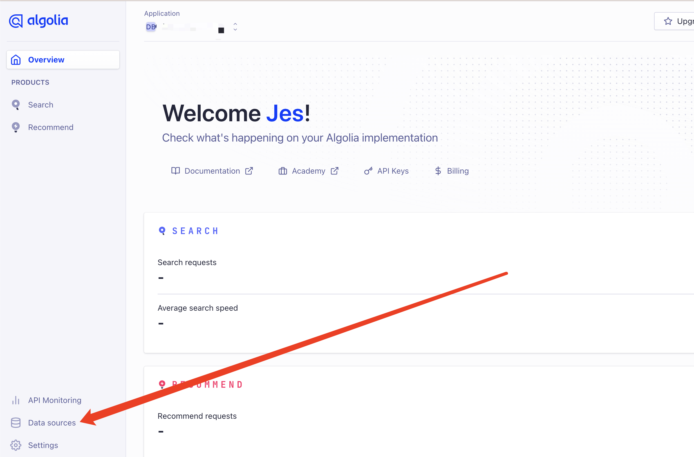
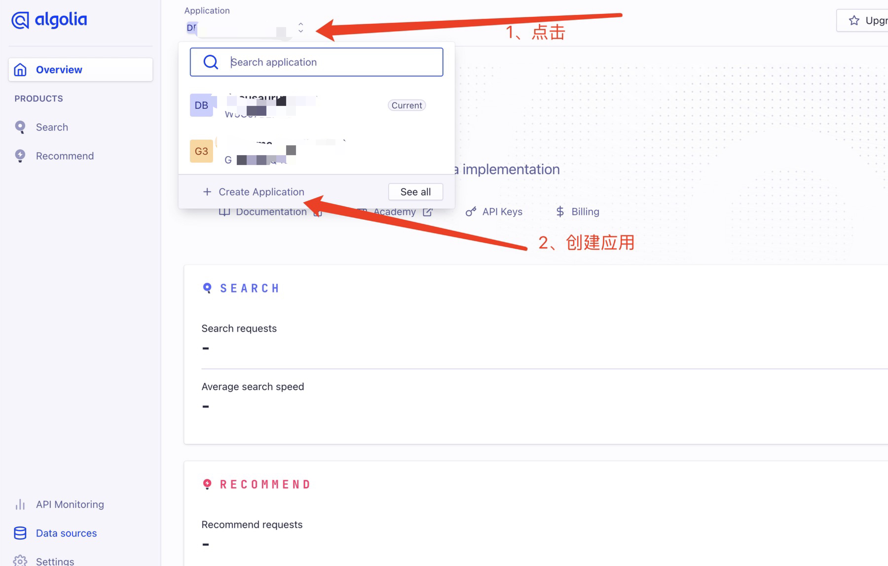
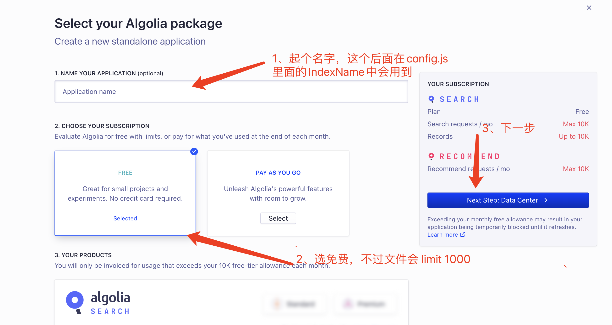
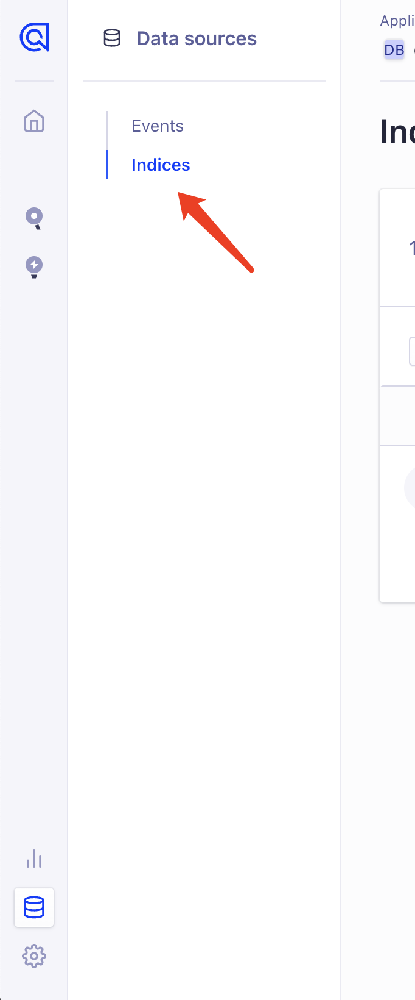
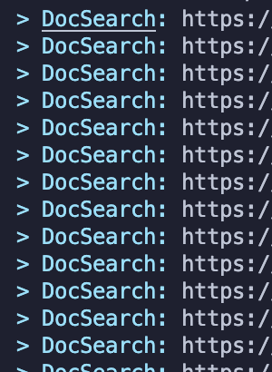

Docusaurus 静态博客搭建使用 algolia 配置搜索。

现在静态博客的标配之一就是博客搜索 🔍，我也是通过搭建博客发现了它，这篇主要记录一下怎么使用 `algolia` 完成博客搜索，自己的博客搭建使用的是 **[docusaurus](https://docusaurus.io/) 。**

<!-- truncate -->

## 注册账号

首先需要去 [algolia](https://www.algolia.com/) 官网注册自己的账号，可以直接使用 Github 注册登陆即可。

注册完后，创建数据源 DB：



## 创建 Application

然后就是创建了你自己的应用了：





创建完之后，需要创建关键的 index 索引了，它用来存放爬取到的内容数据。点击 `Indices`



再给索引起个名字：**这个名字后面会用到！**


## Docusaurus 项目中配置 algolia

Docusaurus 官方已经支持了 algolia 搜索，直接去 `docusaurus.config.js` 文件配置即可：

```
themeConfig: {
		// ...
    algolia: {
      apiKey: "Search-Only API Key",
      indexName: "刚才创建索引的 name，不是数据源的 name",
      appId: "Application ID",
    },
}
```

如果是用其他搭建的比如 Hexo，VuePress/ VitePres，也类似，在对应在 config 文件配置就好。

上面 `apiKey`、`appId` 可以在 **API Keys** 里面查看：


运行项目，就可以看到出现搜索功能，这时候还不能用，因为 algolia 还没有爬取自己网站的内容。

## Docker 爬取本地内容推送到 **Algolia**

**由于 Algolia 限制开源项目才可以免费试用爬虫，所以我们要自己推送数据。需要如下环境：**

- [Docker](https://www.docker.com/)（我的是 mac ，下载安装即可）
- jq（`brew install jq`）—— 解析 json 文件用

爬取环境创建后，完成以下步骤

1、 创建 .env 文件存放环境变量

```makefile
ALGOLIA_APP_ID=xxx
ALGOLIA_API_KEY=xxx
```

2、创建一个`docsearch.json`文件

```json
{
  // 修改部分
  "index_name": "对应上config文件里面的indexName，也是创建的索引名",
  "start_urls": ["https://www.website.com/"], // 自己的域名网站地址
  // 更换自己的域名地址，Docusaurus 官方会有配置生成 sitemap.xml 的方式
  "sitemap_urls": ["https://www.website.com/sitemap.xml"],
  // end
  "stop_urls": ["/search"], // 排除不需要爬取页面的路由地址
  "selectors": {
    "lvl0": {
      "selector": "(//ul[contains(@class,'menu__list')]//a[contains(@class, 'menu__link menu__link--sublist menu__link--active')]/text() | //nav[contains(@class, 'navbar')]//a[contains(@class, 'navbar__link--active')]/text())[last()]",
      "type": "xpath",
      "global": true,
      "default_value": "Documentation"
    },
    "lvl1": "header h1, article h1",
    "lvl2": "article h2",
    "lvl3": "article h3",
    "lvl4": "article h4",
    "lvl5": "article h5, article td:first-child",
    "lvl6": "article h6",
    "text": "article p, article li, article td:last-child"
  },
  "custom_settings": {
    "attributesForFaceting": [
      "type",
      "lang",
      "language",
      "version",
      "docusaurus_tag"
    ],
    "attributesToRetrieve": [
      "hierarchy",
      "content",
      "anchor",
      "url",
      "url_without_anchor",
      "type"
    ],
    "attributesToHighlight": ["hierarchy", "content"],
    "attributesToSnippet": ["content:10"],
    "camelCaseAttributes": ["hierarchy", "content"],
    "searchableAttributes": [
      "unordered(hierarchy.lvl0)",
      "unordered(hierarchy.lvl1)",
      "unordered(hierarchy.lvl2)",
      "unordered(hierarchy.lvl3)",
      "unordered(hierarchy.lvl4)",
      "unordered(hierarchy.lvl5)",
      "unordered(hierarchy.lvl6)",
      "content"
    ],
    "distinct": true,
    "attributeForDistinct": "url",
    "customRanking": [
      "desc(weight.pageRank)",
      "desc(weight.level)",
      "asc(weight.position)"
    ],
    "ranking": [
      "words",
      "filters",
      "typo",
      "attribute",
      "proximity",
      "exact",
      "custom"
    ],
    "highlightPreTag": "<span class='algolia-docsearch-suggestion--highlight'>",
    "highlightPostTag": "</span>",
    "minWordSizefor1Typo": 3,
    "minWordSizefor2Typos": 7,
    "allowTyposOnNumericTokens": false,
    "minProximity": 1,
    "ignorePlurals": true,
    "advancedSyntax": true,
    "attributeCriteriaComputedByMinProximity": true,
    "removeWordsIfNoResults": "allOptional",
    "separatorsToIndex": "_",
    "synonyms": [
      ["js", "javascript"],
      ["ts", "typescript"]
    ]
  }
}
```

控制台执行 docker 爬去推送命令：

```bash
docker run -it --env-file=.env -e "CONFIG=$(cat docsearch.json | jq -r tostring)" algolia/docsearch-scraper
```

需要提前打开下载好的 docker 应用。

接下来就是等待阶段，这里需要点时间 download docker 内置的东西。

最后控制台出现：



说明就在推送本地爬取的内容到 algolia 了。

## 利用 Github Action

可以利用 github 的 Action 帮我们跑这个阶段的内容，这个还是比较方便的。

项目根目录创建 `.github/workflows/docsearch.yml` 文件

内容：

```yaml
name: docsearch

on:
  push:
    branches:
      - master
jobs:
  algolia:
    runs-on: ubuntu-latest
    steps:
      - uses: actions/checkout@v2

      - name: Get the content of docsearch.json as config
        id: algolia_config
        run: echo "::set-output name=config::$(cat docsearch.json | jq -r tostring)"

      - name: Run algolia/docsearch-scraper image
        env:
          ALGOLIA_APP_ID: ${{ secrets.ALGOLIA_APP_ID }}
          ALGOLIA_API_KEY: ${{ secrets.ALGOLIA_API_KEY }}
          CONFIG: ${{ steps.algolia_config.outputs.config }}
        run: |
          docker run \
            --env APPLICATION_ID=${ALGOLIA_APP_ID} \
            --env API_KEY=${ALGOLIA_API_KEY} \
            --env "CONFIG=${CONFIG}" \
            algolia/docsearch-scraper
```

这里说一下设置 github action 触发的条件

- 这个是 push 到 master 分支时触发。

```yaml
on:
  push:
    branches:
      - master
```

- 发布成功后触发

```yaml
on: deployment
```

- 定时触发

```yaml
on:
  schedule:
    # 约每天早上8点触发（UTC时间0点）
    - cron: "0 0 * * *"
```

- 手动触发

```yaml
on:
  workflow_dispatch:
```

我用的是第一种，提交代码更新文件就触发。

> 需要注意的是：免费的创建的 algolia 限制文件 records 1000，如果超过的话，Github Action 会跑失败，所以也就是爬取推送不成功。导致搜索用不了。暂时还不知道怎么解决，所以我都是本地用 docker 的。

## 用起来了

根据上面步骤就可以完成 algolia 的搜索配置功能。
