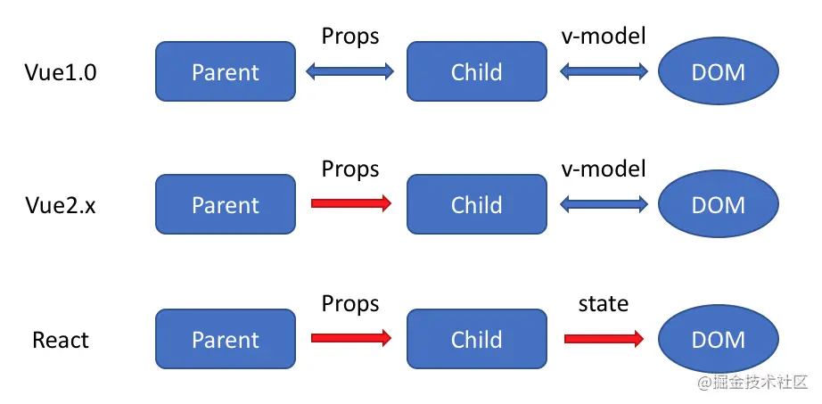

:::tip
react和vue都是做组件化的，整体的功能都类似，但是他们的设计思路是有很多不同的。使用react和vue，主要是理解他们的设计思路的不同。
:::
## 相同点：

- 首先写法上的区别，React 更倾向于原生 JavaScript 模式，模板于逻辑结合在一起，JSX写法；Vue 有专门的 template 模板，只需要关心数据的变化。
### **都是用了 虚拟DOM（Vitrual DOM）**
- Vue 在 Virtual DOM 方面更快捷，很快能计算出更新前后的差异，由于它渲染过程中，vue 会跟踪每一个组件的依赖收集，通过getter/setter 以及一些函数的劫持，能够精准的知道变化，对静态文本节点打上 static 标签。在更新的时候新的 Virtual DOM 和旧的 Virtual DOM 进行对比，跳过 static 静态节点，所以不需要渲染整个组件树。
- React 则默认通过比较引用的方式，当某个组件发生变化，它会以根节点为主，遍历所有子组件，如果避免子组件不必要的渲染，类组件需要使用 PureComponent ，shouldComponentUpdate 的方式来控制不必要的渲染。

## 区别：

### **构建工具方面**
- Vue 使用的 Vue-CLI ，在Vue3 中默认会帮你装 Vite 工具，一个更快的打包工具。
- React 工程搭建使用的是 Create-react-app ，相对于 Vue React工程创建是比较干净化的，需要其他的自己可以选择搭配。Vue-CLI 可以默认选择某些模板。
### **数据流**

    
- vue 只能parent -> Child <-> DOM的形式
- react 而只能单向传递，**React一直提倡的是单向数据流**，数据主要从父组件传递到子组件（通过props，或者redux），如果顶层的父组件某个 props 发生改变，那么会渲染所有的子组件，这是时候需要用 PureComponent ，shouldComponentUpdate 方式控制子组件的不必要的渲染，不过在函数组件中，setState 触发更新默认会浅比较新旧 state ，或者想达到 PureComponent 类组件的效果，可以使用 React.memo 包裹组件，这样会浅比较 props 。类组件 setState 不会不会默认浅比较新旧 state。
- 比如 react 使用 context，被 provider 包裹的组件，只要 provider value 值有更新，那么没有做控制渲染的前提下，所有的子组件也都会渲染。
### **监听数据变化的方式不同**
- vue 通过 setter/getter 以及一些函数的劫持。能精确知道数据的变化。
- react 默认通过引用的方式（diff），如果不优化可能导致大量不必要的VDOM的重新渲染。
### **模板方式渲染不同**
- React
- React 通过JSX渲染模板，使用 React.createElement 构建 DOM；
- React 通过原生 JS 实现模板中常见语法，一些列表渲染，条件，三元运算符号。
- React 引用组件方面：React 想使用一个组件直接 import 导入之后就可以直接使用。（react 组件定义默认的props属性类型是使用 defaultPropsName）
- React 使用的 redux，获取 state 通过 useSelelctor或者 store.getState()，更新 state 通过 useDispatch函数返回 dispatch。
- Vue
- Vue 通过扩展的 HTML 来进行模板渲染；
- Vue 有通过指令v-for、v-if、v-show、v-model双向绑定数据等等。还可以自定指令。完成我们想要的效果，比如 权限指令 。
- Vue 引用组件的方式：import 导入组件之后还需要在 component 属性中定义引入的组件（vue定义props属性名和类型直接在模板定义。）。
- Vue 使用的是 vuex
- 可以直接通过 this.$store.xxx 拿到 state 的值。不过在 vue3 中也是拥抱 hook，使用 useStore 获取state，action，dispatch。
### **组件通信的区别**
- vue组件通信三种方式：父组件通过 props 像子组件或者回调传递数据；子组件通过事件向父组件发送消息；provide/inject 实现父组件向子组件注入数据，可以跨多个层级。
- react：props 和 callback；ref 方式；redux 状态管理方式；context 上下文方式；event bus 事件总线。

1. 写法：
    - react使用jsx语法（如果要在JS里写HTML，就是创造一个一个的DOM对象，用JS来写，会非常的冗余并且不能一目了然的看清楚DOM的结构。所以就扩展成了JSX，直接用HTML的写法在js中写DOM）

    - Vue使用模板系统而不是JSX，使其对现有应用的升级更加容易。这是因为模板用的就是普通的HTML，通过Vue来整合现有的系统是比较容易的，不需要整体重构。
2. 数据更新：

    - Vue采取依赖追踪，默认是优化状态：按需更新；

    - React在则有两种选择：

        - 1）手动添加shouldComponentUpdate，来避免冗余的vdom，re-render的情况

        - 2）Components 尽可能都用 pureRenderMixin，然后采用 redux 结构 + Immutable.js（感受一波）

    react整体是函数式的思想，把组件设计成纯组件，状态和逻辑通过参数传入，所以在react中，是单向数据流，推崇结合immutable来实现数据不可变。react在setState之后会重新走渲染的流程，如果shouldComponentUpdate返回的是true，就继续渲染，如果返回了false，就不会重新渲染，PureComponent就是重写了shouldComponentUpdate，然后在里面作了props和state的浅层对比。

    而vue的思想是响应式的，也就是基于是数据可变的，通过对每一个属性建立Watcher来监听，当属性变化的时候，响应式的更新对应的虚拟dom，支持双向绑定。

   总之，react的性能优化需要手动去做，而vue的性能优化是自动的，但是vue的响应式机制也有问题，就是当state特别多的时候，Watcher也会很多，会导致卡顿，所以大型应用（状态特别多的）一般用react，更加可控。

3. 类式的组件写法，还是声明式的写法

    - react是类式的写法，api很少，

    - vue是声明式的写法，通过传入各种options，api和参数都很多。所以react结合typescript更容易一起写，vue稍微复杂。

   react可以通过高阶组件（Higher Order Components--HOC）来扩展，而vue需要通过mixins来扩展

## 框架本质不同

- Vue本质是MVVM框架，由MVC发展而来；

- React是前端组件化框架，由后端组件化发展而来。

## Vuex和Redux的区别

- 从表面上来说，store注入和使用方式有一些区别。在Vuex中，$store被直接注入到了组件实例中，因此可以比较灵活的使用：使用dispatch、commit提交更新，通过mapState或者直接通过this.$store来读取数据。在Redux中，我们每一个组件都需要显示的用connect把需要的props和dispatch连接起来。另外，Vuex更加灵活一些，组件中既可以dispatch action，也可以commit updates，而Redux中只能进行dispatch，不能直接调用reducer进行修改。

- 从实现原理上来说，最大的区别是两点：Redux使用的是不可变数据，而Vuex的数据是可变的，因此，Redux每次都是用新state替换旧state，而Vuex是直接修改。Redux在检测数据变化的时候，是通过diff的方式比较差异的，而Vuex其实和Vue的原理一样，是通过getter/setter来比较的，这两点的区别，也是因为React和Vue的设计理念不同。React更偏向于构建稳定大型的应用，非常的科班化。相比之下，Vue更偏向于简单迅速的解决问题，更灵活，不那么严格遵循条条框框。因此也会给人一种大型项目用React，小型项目用Vue的感觉。

## 监听数据变化的实现原理不同

- Vue通过 getter/setter以及一些函数的劫持，能精确知道数据变化。

- React默认是通过比较引用的方式（diff）进行的，如果不优化可能导致大量不必要的VDOM的重新渲染。为什么React不精确监听数据变化呢？这是因为Vue和React设计理念上的区别，Vue使用的是可变数据，而React更强调数据的不可变，两者没有好坏之分，Vue更加简单，而React构建大型应用的时候更加鲁棒。

## 组件通信的区别

- Vue中有三种方式可以实现组件通信：父组件通过props向子组件传递数据或者回调，虽然可以传递回调，但是我们一般只传数据；子组件通过事件向父组件发送消息；通过V2.2.0中新增的provide/inject来实现父组件向子组件注入数据，可以跨越多个层级。

- React中也有对应的三种方式：父组件通过props可以向子组件传递数据或者回调；可以通过 context 进行跨层级的通信，这其实和 provide/inject 起到的作用差不多。React 本身并不支持自定义事件，而Vue中子组件向父组件传递消息有两种方式：事件和回调函数，但Vue更倾向于使用事件。在React中我们都是使用回调函数的，这可能是他们二者最大的区别。

## 构建工具

- React和Vue都有自己的构建工具，你可以使用它快速搭建开发环境。React可以使用Create React App (CRA)，而Vue对应的则是vue-cli。两个工具都能让你得到一个根据最佳实践设置的项目模板。

- 由于CRA有很多选项，使用起来会稍微麻烦一点。这个工具会逼迫你使用Webpack和Babel。而vue-cli则有模板列表可选，能按需创造不同模板，使用起来更灵活一点。

## 生命周期

生命周期对比表
|      vue      |                                 react                                 |
| :-----------: | :-------------------------------------------------------------------: |
| beforeCreate  |                                                                       |
|    created    |                                                                       |
|  beforeMount  |                           componentDidMount                           |
|    mounted    |                           componentDidMount                           |
| beforeUpdate  | componentWillReceiveProps, shouldComponentUpdate, componentWillUpdate |
|    updated    |                          componentDidUpdate                           |
| beforeDestroy |                         componentWillUnmount                          |
|   destroyed   |                          componentDidUnmount                          |

vue对比react相关的生命周期，可以看出从beforeMount开始和react基本一致，只是react在视图更新前做了更细粒度的控制，componentWillReceiveProps, shouldComponentUpdate,  componentWillUpdate 这三个方法都接收nextProps和nextState两个参数，允许你在这三个方法中针对新数据决定是否渲染，以及如何渲染的控制。

vue中beforeCreate和created这两个方法是react中没有的，这也是vue与react本质不同的体现，vue中有data、computed、method等等属性，这两个方法就是把这些属性注入到模板中的过程，注入后才参与后面模板的编译，生成dom，挂载等等操作。在beforeCreate中访问实例的data这些属性是undefined，所以在这里可以用于设置data的初始值，created中这些属性就已经被绑在实例上可以访问了。

## vue实例属性方法

- data
vue中的data属性类似于react中的state，属于组件的私有数据，不同在于react中state是通过setState()方法进行更新的，而vue中data除了通过直接赋值改变其值，还可以通过v-model这个语法糖进行数据双向绑定，这个主要用于表单组件。

- props
vue中props和react中的props类似，不同的是vue中的props来源于父组件，而react中props除来自于父组件还来自于redux中的数据。

- computed
computed属性是vue的一大特色，它依赖于props、data生成新的计算数据，会根据props和data的改变而改变。computed中的数据默认只有getter属性，也可设置setter属性。在react中想对props或者state再加工一般都是另外再初始化一个state数据或者在render函数中创建临时变量，特别是一些在显示前的排序过滤方法都在render里调用。另外computed中还包括vuex中mapState和mapGetters的数据。

- method
method是放各种方法的地方，包括vuex中mapActions的方法，而react中，react-redux将action取出来作为props传入组件中。

- watch
watch一般用于观测数据变化不会触发视图更新的数据，或者是需要根据数据变化做其他操作情景，比如子组件数据更新通知父组件。watch的回调函数接收（val, oldVal），这个和react中更新前的几个生命周期的用法有点类似，props或者state改变就会触发。而且watch的数据有deep配置项，可以监测对象内部的变化。

## vue组件

vue和react都是组件化、模块化思想的产出，vue推荐单文件组件，就是把template、js、css写在一个文件里，这个优点就是修改代码不用切换文件，每个组件的样式、模板、事件都在一个文件里，react虽然是JSX，但是样式控制在单独的文件里（现在也有了CSS in JavaScript的样式框架）。不过vue这样有个缺点就是组件稍微大一点，单个文件代码行数就暴多，轻而易举就上300行。

### 组件通信

vue的组件通信有三种方法，下面依次讲讲：

- props & $on & $emit
这种方法主要用于父子组件间的通信，父组件通过绑定动态props将父数据传给子组件，子组件通过$emit事件触发父组件上通过$on绑定的自定义事件，并将子组件的数据抛上去。
- eventBus & $emit
eventBus常用于同代组件间的通信，它是实际上是另外定义的一个全局vue实例，在此实例上订阅t和触发事件可以在全局有效。使用方法和前一种一样，但是这个在组件中订阅时要记得卸载前取消事件订阅，因为vue不会在生命周期结束时自动取消eventBus事件的订阅，会造成全局污染。而且这种方法适用于单个组件，如果是list那种循环组件，不宜在每个list item上进行全局事件订阅。
按理说在有了vuex不需要eventBus，但在此个人认为，vuex是管理数据状态的，是一个全局数据存储的地方，如果不是全局都要用的，不跨路由，就不需要存起来，应该考虑用eventBus，不能说有了vuex，props什么的都不用了，什么数据都丢到vuex，要用的都从里面取，随着项目复杂度的增加，数据管理就会变得杂乱，我们应该像后端设计数据库一样来设计前端的数据管理。
- vuex
上一种方法中也说到了vuex，vuex其实能cover上面两种方法的情景，但是就像上面说的，不能说vuex好用就滥用，就像好吃的东西吃多也会撑死。根据上一个react-redux产品项目中redux的应用，我们就是将全局需要的数据才存到redux，供跨路由数据存取，不需要的都通过props，state来解决，就是这样，随着产品迭代，新功能增加，store中的数据都变得难以维护，再加上最开始数据结构设计过于依赖业务逻辑，导致一些扩展困难。所以前端数据结构设计也很重要。
vuex还是应该用于存储全局数据，跨路由，跨多个组件，比如祖父子组件间的通信，业务之间跨越比较大的组件间的通信。

## vuex

vuex是专为vue设计的数据管理，就vuex和redux的异同我做了些研究，他们本质区别是redux设定数据是immutable的， 而vuex设定数据是mutation的，redux中每次数据更新都会生成新的store tree，而vuex就是在store tree上直接修改。下面针对vuex各个部分和redux对比总结下。

- state
state就是store中的数据，是唯一数据源的存在，这个概念和redux中store是一样的，通过辅助方法mapState，可将多个state解构在组件computed方法中，这个和react-redux中的mapStateToProps类似。

- getter
getter是对state的再加工，类似于vuex中的计算属性，他和react项目中reselect插件实现一样的功能，vuex将其集成了。通过mapGetters可以将这些getter映射到局部计算属性，react中则是直接import。

- mutation
mutation类似redux中reducer的作用，数据的改变就发生在这个部分，这个部分也是vuex和redux本质区别的地方，vuex在mutation中改变store上的相关数据的值，而redux在这里是根据actiontype和playload返回的是一个新的数据。另外mutation中是同步函数，异步函数不能在此执行。

- action
action和redux中的action类似，可以执行异步操作，可以分发action，和redux中的middleware类似。

- modules
modules将store分割成不同模块，每个模块拥有自己的state、mutation、action、getter，这个思想和redux中reducer拆分类似，不过reducer合并的时候生成了新的store tree。

### vuex的store中的状态是响应式的，和vue遵循一样规则

- 初始化所有的所需属性
当需要再对象上添加新属性是，应该用Vue.set或者用对象展开运算符
这个规则是我觉得vue挺尴尬的地方，他无法监测到对象内部的变化，你直接赋值改变对象他是无感的，无法响应，经常出现数据已经更改，视图没有更新。对于非引用类型的数据他让你直接赋值更改，然后响应，也就是mutation，而对于引用类型的数据，你必须给以新对象替换老对象它才能响应，个人觉得这是一种不一致性的表现。虽然它给出了Vue.set的解决方法，但是在2.0中，Vue.set不接受keyPath的方式动态增加属性，很多时候存在超过二级嵌套属性时，就贼尴尬了。在社区里找了半天，找到了vue-deepset插件，然后就完美解决vue和vuex中动态增加属性的问题。

- Personal opinion
由于我刚入前端时就学习的是react框架，没什么历史负担，所以对于react具有侵略性的JSX是很快就接受了，它将JS和HTML部分糅合在一起了，这对于老前端来说是很难接受的，但是前端组件化、模块化是大势所趋，vue的出现解决了这个问题，记得vue的英文版是这么描述自己的

Vue (pronounced /vju?/, like view) is a progressive framework for building user interfaces. Unlike other monolithic frameworks, Vue is designed from the ground up to be incrementally adoptable.

progresive渐进式增强，我理解的另一个意思，就是一步一步将以前的项目向组件化、模块化演变提供了循序渐进的途径。