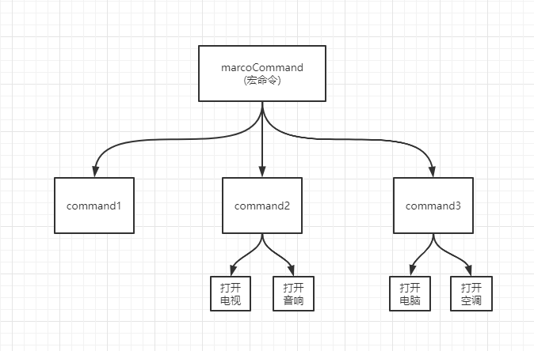

### 组合模式

- 组合模式在对象间形成树形结构
- 组合模式中基本对象和组合对一致对待
- 无须关心对象有多少层，调用时只需在根部进行调用

举个:chestnut:想象回到家中，手里有个全自动的遥控器，按一下开关，会有下面的事情执行：

```js
1.煮咖啡
2.打开电视、打开音响
3.打开控件、打开电脑
```

把任务分成三类：



看看编写的代码段：

```js
const MacroCommand = function () {
  return {
    lists: [] as any,
    add(task) {
      this.lists.push(task)
    },
    excute() {
      this.lists.forEach(fn => {
        fn.excute()
      })
    }
  }
}


const command1 = MacroCommand()

command1.add({
  excute() {
    console.log('煮咖啡了~')
  }
})

const command2 = MacroCommand()

command2.add({
  excute() {
    console.log('打开电视~')
  }
})
command2.add({
  excute() {
    console.log('打开音响~')
  }
})


const command3 = MacroCommand()

command3.add({
  excute() {
    console.log('打开电脑~')
  }
})

command3.add({
  excute() {
    console.log('打开空调~')
  }
})


const macroCommand = MacroCommand()
macroCommand.add(command1)
macroCommand.add(command2)
macroCommand.add(command3)

console.log(macroCommand,'macroCommand')

macroCommand.excute()

// output
煮咖啡了~
打开电视~
打开音响~
打开电脑~
打开空调~
```
