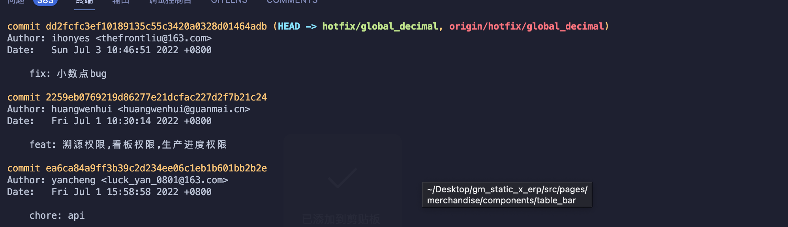
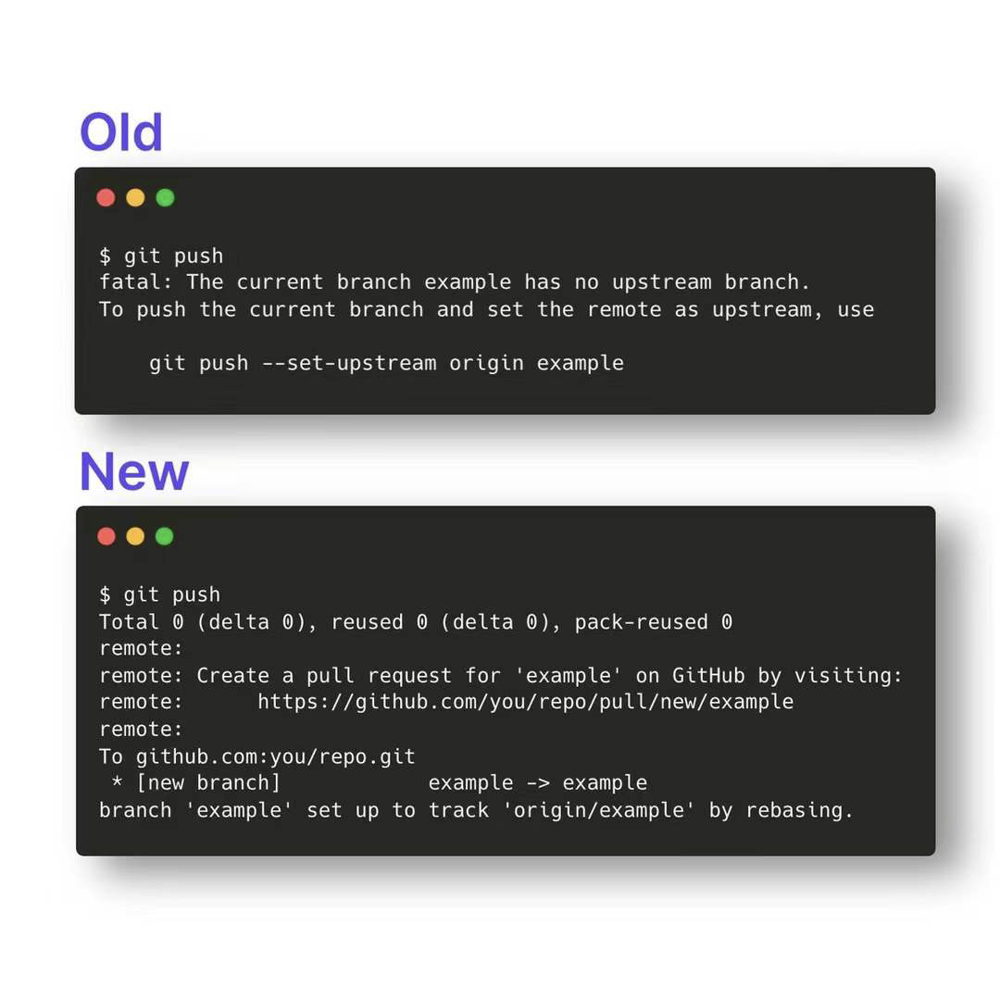
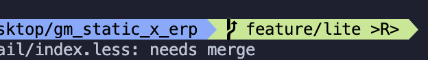

# 日常Git操作


前端打包需要提供 tag 给运维拉取包更新，下面的正确操作就是：

```bash
# 先添加暂存
git add .

# 提交本地仓库 commit 
git commit -m 'xxxx'

# 获取对应的 commit id
git log --pretty=oneline --abbrev-commit

# 打对应的版本 tag 加上刚才上一步查看对应 commitId，关联到下面
git tag v1.0.1 {commitId}

# 提交 tag 
git push origin v1.0.1

# 再提交你的本地 commit 
git push origin production

# 这样就可以了

# 删除对应 tag
git tag -d v1.0.1

# 提交远程到
git push origin :refs/tags/v1.0.1

# 补打标签就是创建 tag 没有加标签 commitId 那么可以这样
git tag -a v1.0.1 9fbc3d0
```

撤销本地 commit 并保留当前修改

```bash
git reset --soft HEAD^
```

删除本地分支

```bash
# 需要切换到其他分支，不然会删除不成功。

git branch -D {分支名}
```

删除远程分支

```bash
// 删除远程分支
git push origin --delete remoteBranchName
```

其他分支合并到另一个分支正确操作方式

举例：

- 所在开发分支：feature/my_order_optimize_3.3
- 将功能合并到的分支：feature/1023875_order_optimize

```bash
# 1、删除本地分支

# 2、将所在开发的分支 rebase 合并到需要合并到的分支上
git rebase {合并到的分支}

# 3、查看log是否 rebase 成功
git log

# 4、切换{合并到的分支}。执行 merage
git merage {所在开发分支}

# 5、push
git push
```

```bash
# 此命令的用法就是，再当前的分支上，拉取远程其他最新的分支
git fetch

# 例子
# 我当前在 master 分支

master> git fetch origin {其他远程分支}
# 这样就可以直接在本地拉取了 {其他远程分支} 上的代码了，然后 checkout 即可
```

```bash
# 当前分支使用其他分支的commit代码
git cherry-pick {commitId}

# 详细看：https://www.ruanyifeng.com/blog/2020/04/git-cherry-pick.html

# 直接push就会生成commit记录
git push
```

### 合并多个 commit

```bash
# 从 HEAD 合并到第八个
git rebase -i HEAD~8
```

```bash
git fetch origin {需要合并的分支}
git merge origin {需要合并的分支}
```

```bash
# 当前的最后一个 commitId 合并到某个 commitId
git rebase -i 6ad457782
```

### vim Commit 合并操作指令

```bash
:2,$s/pick/f/g
```



比如说合并 commit ，如果说我想合并 fix 小数点上面的所有 commit 节点，

我们就可以操作

```bash
git rebase -i 2259eb0769219d86277e21dcfac227d2f7b21c24
```

这样会打开 vim，在 `:` 号加`2,$s/pick/f/g` 命令回车直接搞定

最后只会留下 fix: 小数点bug 的 commit 在他前面的都会被合并到最后一个节点里面。

`git commit --amend` 合完节点之后修改最后一个节点的 commit 信息 。

或者合并还可以这样，比如当前开发节点合并 commit 到 主分支，那么可以用：`git rebase -i feature/lite`

### SSH 免密登录命令生成

生成 ssh：

```bash
ssh-keygen -t rsa -P '' -f ~/.ssh/id_rsa -C "user.email"
```

快速打开 ssh config 文件：

```bash
vim ~/.ssh/config

=>
Host github.com
    HostName github.com
    User favoorr
    IdentityFile ~/.ssh/id_rsa

Host dev1
    HostName dev1
    User youname
    IdentityFile ~/.ssh/id_rsa_yourdomain_gitlab
```

```
https://favoorr.github.io/2015/05/27/git-more-sshkeys-more-host/
```

在最新版的 Git 2.37.0 中，开启如下配置项后就能直接 git push 新分支，不再需要 --set-upstream origin：
git config --global --add --bool push.autoSetupRemote true



### git 一些小操作技巧

当还有一个本地还有一个 commit log，但是不需要用到，上一条已经合完了其他的 commit 那么，我们可以直接使用回滚的方式 git reset HEAD~{count}，提交的时候 commit —amend 不新增提交记录就可以了

**从远程分支创建本地分支**

```bash
git checkout -b 本地分支名x origin/远程分支名x
```

### 提交 commit  不显示commit 信息

```bash
git commit --amend
```

### 根据 commitId 切分支

```bash
git checkout {commitId} {本地新分支名}
```

### 退出合并


```bash
git merge --abort
```

### git 分支重命名

```bash
# 1、本地分支重命名

git branch -m old new

# 远程分支重命名
# 2、删除远程分支

git push origin :{你要删除的远程分支名}

# 3、将本地分支推送到远程分支上，如果远程分支不存在，则创建此远程分支

git push origin 本地分支名:远程分支名
```

### 回滚用 reset 还是 revert

[https://zhuanlan.zhihu.com/p/137856034](https://zhuanlan.zhihu.com/p/137856034)

### pull —rebase 的时候



如果还有冲突 继续 

```bash
git rebase --continue
```

没有的话那么就 退出

```bash
git rebase --abort
```

### 当前分支落后于主线分支操作

当前的开发分支：`feature/1025848-eshop`，主线分支：`feature/lite` 

① 切换到主线分支`feature/lite`：

```bash
git checkout feature/lite
```

② 拉取远程主线分支`feature/lite`到本地的主线分支`feature/lite：`

```bash
git pull --rebase
```

③ 切回到当前的开发分支`feature/1025848-eshop`：

```bash
git checkout feature/1025848-eshop
```

④ 拉取远程分支`feature/lite` 的代码：

```bash
git rebase feature/lite
```

⑤ 将当前开发分支分支`feature/1025848-eshop`提交到远程分支`feature/1025848-eshop`：

```bash
git push origin feature/1025848-eshop -f

```

### git 查看远程仓库信息

列子：

```bash
git ls-remote --heads  
# abc150b184007a4248a0e993b547194494964e17        refs/heads/master

仓库地址
git ls-remote --get-url
# git@code.guanmai.cn:fe-x/gm_api_script.git
```

git log 查看远程分支 log 信息

```bash
git log remotes/origin/master
```

### git 更换源仓库地址

第一种 

```bash
git remote remove origin

# 然后再添加新的
git remote add origin {url}
```

第二种

```bash
git remotea set-url origin "clone地址"
```

### 获取完整 commit id

```tsx
git rev-parse HEAD
```

### 打印最近一次提交信息

```bash
git reset HEAD --hard

# HEAD is now at b4c23ad9f WIP: update
```

### 移除 git 远程仓库地址

```bash
git remote remove origin
```

### Git Flow 工作流学习

[https://www.git-tower.com/learn/git/ebook/cn/command-line/advanced-topics/git-flow](https://www.git-tower.com/learn/git/ebook/cn/command-line/advanced-topics/git-flow)