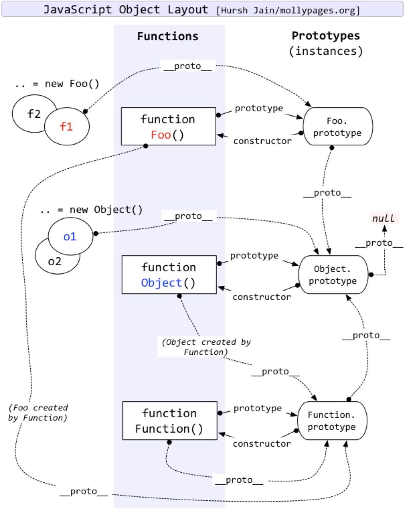

## 原型

**含义：**

每一个 JavaScript 对象在创建的时候就会与之对应关联另一个对象，这个对象就是我们所说的原型。每一个对象都会从原型继承属性，其实就是 prototype。比如说定义了一个 obj 那么会关联 Object 对象。继承了 Object 对象原型属性，因此我们创建的 obj 对象就有了 Object 原型上面的方法。

流程图：
首先创建构造函数就有了一个 prototype 属性——>这个属性包含了所有共享实例属性和方法——>所以我们可以推断出这个 prototype 属性就是调用构造函数（new xxx()）而创建的实例的那个原对象。因此可以达到继承所有属性和方法——————>所以 xxxx(构造函数).prototype == xxxx(实例对象).`__proto__` // true

## 原型链

继承 主要就是依靠原型链来实现的。

概念：继承的基本思想就是其利用原型让一个引用类型继承另一个引用类型的属性和方法。我们回顾一下上面所说的概念，我们知道一个构造函数都一个一个原型对象（prototype），原型对象都包含一个指向构造函数内部的指针，而实例对象的原型（`__proto__`）又是通过构造函数原型对象创建出来的。那么假如我们，将原型对象等于另一个类型的实例（`xxx.prototype= new xxxx()`）,因为另一个类型的实例（`__proto__==xxx.prototype`）,所以原型
`xxx1.prototype == xxx2.prototype` 从而继承了另一个原型上的属性和方法。

官方术语：简单回顾一下构造函数、原型和实例的关系：每个构造函数都有一个原型对象，原型对象都包含一个指向构造函数的指针，而实例都包含一个指向原型对象的内部指针。那么假如我们让原型对象等于另一个类型的实例，结果会怎样？显然，此时的原型对象 将包含一个指向另一个原型的指针，相应的另一个原型中也包含这一个指向另一个构造函数的指针。假如另一个原型又是另一个类型的实例，那么上述关系依然成立，如此层层递进，就构成了实例与原型的链条，这就是所谓原型链的基本概念。

**例子：**

创建一个 Foo 构造函数

```js
function Foo(name) {
  this.name = name;
}

const foo = new Foo("prototype");

console.log(foo.__proto__ === Foo.prototype); // true
console.log(Foo === Foo.prototype.constructor); // true

// 顺便学习一个ES5的方法,可以获得对象的原型
console.log(Object.getPrototypeOf(person) === Person.prototype); // true
```

理解图：


## 原型继承

### 1.借助构造函数继承：

```javascript
/**
 * 借助构造函数实现继承
 */
function Parent1() {
  this.name = "parent1";
}

function Child1() {
  Parent1.call(this); //因为将Parent1构造函数的this重新指向了Child1中的this，而Parent1中的this有name属性，所以Child1实现了Parent1的继承
  this.type = "child1";
}
console.log(new Parent1(), new Child1());
// 缺点   ————子类拿不到父类的方法
Parent1.prototype.say = function () {
  console.log("say");
};
```

优点：可以在子类型构造函数中向超类型构造函数添加参数
这时 打印 Child1.say()获取不到  ,所以只能实现部分继承（父类的属性都在构造函数里面就能实现，如果不在，在它的原型上则无法实现其他继承）

### 2.借助原型链实现继承:

```javascript
/**
 * 借助原型链实现继承
 */
function Parent2() {
  this.name = "parent2";
  this.play = [1, 2, 3];
}

function Child2() {
  this.type = "child2";
}
Child2.prototype = new Parent2();
console.log(new Child2().__proto__);
var s1 = new Child2();
var s2 = new Child2();
console.log(s1, s2);
s1.play.push(4);
console.log(s1.play, s2.play); // [1,2,3,4] ,[1,2,3,4]
// 缺点 —————用原型链继承
```

因为 s1.**proto** === s2.**proto** ,s1 s2 中的 play 引用的是用同一个对象（父类 Parent2 中的 play）,而且是引用类型（不会保存和复制值的本身） 所以 play 属性一起同有也一起改变了。
缺点：1. 包含引用类型的原型属性会被所有实例属性共享，容易造成属性的修改混乱。 2.在创建子类型的实例时，不能向超类型的构造函数中传递参数。

### 3.组合方式，上面的第一种和第二种结合起来

```javascript
/**
 * 组合方式，上面的第一种和第二种结合起来
 */
function Parent3() {
  this.name = "parent3";
  this.play = [1, 2, 3];
}

function Child3() {
  Parent3.call(this);
  this.type = "child3";
}
Child3.prototype = new Parent3();
Child3.prototype.constructor = Child3;
// console.log(new Child2().__proto__)
var s3 = new Child3();
var s4 = new Child3();
// console.log(s1, s2)
s3.play.push(4);
console.log(s3.play, s4.play); // [1,2,3,4] ,[1,2,3]
// 解决了上面第二种原型链方式的缺点
```

优点：组合继承避免了原型链和借用构造函数的缺陷，融合了它们的优点，成为 JavaScript 中最常用的继承模式。而且，instanceof 和 isPropertyOf() 也能够用于识别基于组合继承创建的对象。
缺点  ———父类 Parent3 执行了两次 第一次是 Parent3.call(this)执行了一次，第二次是 Child2.prototype = new Parent2()又执行了一次，总的执行了两次。

### 4.（原型式继承）组合继承优化 1

```javascript
/**
 * 组合继承优化1
 */
function Parent4() {
  this.name = "parent4";
  this.play = [1, 2, 3];
}

function Child4() {
  Parent4.call(this);
  this.type = "child3";
}
Child4.prototype = Parent4.prototype;
//这样实现了只执行的一次 Parent4.prototype === new Parent4().__proto__
var s5 = new Child4();
var s6 = new Child4();
console.log(s5 instanceof Child4, s6 instanceof Child4); // true，true
```

### 5.（寄生式组合继承）组合继承优化 2

```javascript
/**
 * 组合继承优化2
 */
function Parent5() {
  this.name = "parent5";
  this.play = [1, 2, 3];
}

function Child5() {
  Parent5.call(this);
  this.type = "child5";
}
Child5.prototype = Object.create(Parent5.prototype); //
Child5.prototype.constructor = Child5; //实现子父隔离
```
