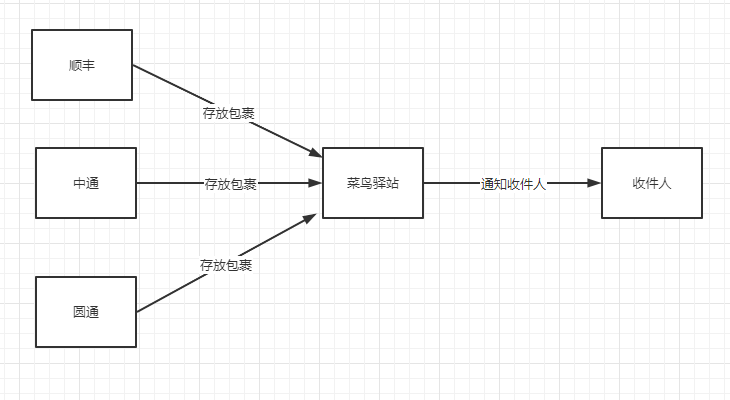
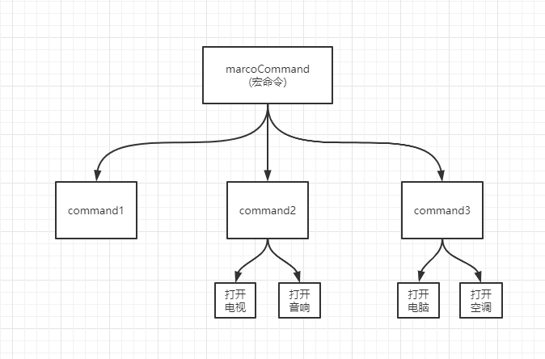

- 创建型
  - 工厂模式
  - 单例模式
  - 原型模式

- 结构型
  - 适配器模式
  - 代理模式
  - 装饰器模式
  - 组合模式

- 行为型
  - 策略模式
  - 迭代器模式
  - 发布订阅模式
  - 观察者模式
  - 命令模式
  - 状态模式

## 创建型模式

### 工厂模式

工厂模式中，我们在创建对象时不会对客户端暴露创建逻辑，并且是通过使用一个共同的接口来指向新创建的对象，用工厂方法代替new操作的一种模式。

```js
class Creator {
    create(name) {
        return new Animal(name)
    }
}

class Animal {
    constructor(name) {
        this.name = name
    }
}

var creator = new Creator()

var duck = creator.create('Duck')
console.log(duck.name) // Duck

var chicken = creator.create('Chicken')
console.log(chicken.name) // Chicken
```

#### 小结

1. 构造函数和创建者分离，对new操作进行封装
2. 符合开放封闭原则

### 单例模式

单例模式适用于全局只能有一个实例对象的场景，结构如下：

```javascript
function Single() {}

Single.getIntance = function () {
  if (this.instance) {
    return this.instance;
  }

  this.instance = new Single();
  return this.instance;
};
```

上述代码中 `Singleton`类挂载了一个静态方法`getInstance`，如果要获取实例对象只能通过这个方法拿，这个方法会检测是不是有现存的实例对象，如果有就返回，没有就新建一个

#### 单例模式两个条件

- 确保只有一个实例
- 可以全局访问

#### 适用

> 适用于弹窗的实现，全局缓存

#### 弹窗实现

```javascript
/**单例闭包弹窗 */
const createLoginLayer = function () {
    const div = document.createElement('div')
    div.innerHTML = '登入窗口'
    // div.style.display = 'none'
    document.body.appendChild(div)
    return div
}

const getSingle = function (fn) {
    const result
    return function () {
        return result || fn.apply(this, arguments)
    }
}

const createSingleLoginLayer = getSingle(createLoginLayer)


document.getElementById('loginBtn').onclick = function () {
    createSingleLoginLayer()
}
```

#### 全局数据对象

假如有一个需求

> 需要对一个全局的数据对象进行管理，这个对象只能有一个，如果有多个会导致数据不同步。

如果还想支持`store()`直接调用，可以用前面工厂模式用过的方法，检测`this`是不是当前类的实例，如果不是就帮他用`new`调用就行了：

```javascript
function store() {
  // 加一个instanceof检测
  if (!(this instanceof store)) {
    return new store();
  }

  // 下面跟前面一样的
  if (store.instance) {
    return store.instance;
  }

  store.instance = this;
}
```


#### 实例：vue-router

`vue-router`其实也用到了单例模式，因为如果一个页面有多个路由对象，可能造成状态的冲突，`vue-router`的单例实现方式又有点不一样，[下列代码来自`vue-router`源码](https://github.com/vuejs/vue-router/blob/dev/src/install.js)：

```javascript
let _Vue;

function install(Vue) {
  if (install.installed && _Vue === Vue) return;
  install.installed = true;

  _Vue = Vue;
}
```

每次调用`vue.use(vueRouter)`的时候其实都会去执行`vue-router`模块的`install`方法，如果用户不小心多次调用了`vue.use(vueRouter)`就会造成`install`的多次执行，从而产生不对的结果。`vue-router`的`install`在第一次执行时，将`installed`属性写成了`true`，并且记录了当前的`Vue`，这样后面在同一个`Vue`里面再次执行`install`就会直接`return`了，这也是一种单例模式。


#### 小结

1. 单例模式的主要思想就是，实例如果已经创建，则直接返回

```js
function creatSingleton() {
    var obj = null
    // 实例如已经创建过，直接返回
    if (!obj) {
        obj = xxx
    }
    return obj
}
```

2. 符合开放封闭原则

### 原型模式

> 用原型实例指定创建对象的种类，并且通过拷贝这些原型创建新的对象。--百度百科

在JavaScript中，实现原型模式是在ECMAScript5中，提出的Object.create方法，使用现有的对象来提供新创建的对象的__proto__。

```js
var prototype = {
    name: 'Jack',
    getName: function() {
        return this.name
    }
}

var obj = Object.create(prototype, {
    job: {
        value: 'IT'
    }
})

console.log(obj.getName())  // Jack
console.log(obj.job)  // IT
console.log(obj.__proto__ === prototype)  //true
```

1. 方法继承

```js
var Parent = function() {}
Parent.prototype.show = function() {}
var Child = function() {}

// Child继承Parent的所有原型方法
Child.prototype = new Parent()
```

2. 所有函数默认继承`Object`

```js
var Foo = function() {}
console.log(Foo.prototype.__proto__ === Object.prototype) // true
```

3. `Object.create`

```js
var proto = {a: 1}
var propertiesObject = {
    b: {
        value: 2
    }
}
var obj = Object.create(proto, propertiesObject)
console.log(obj.__proto__ === proto)  // true
```

4. `isPrototypeOf`

`prototypeObj`是否在obj的原型链上

```js
prototypeObj.isPrototypeOf(obj)
```

5. `instanceof`

`contructor.prototype`是否出现在`obj`的原型链上

```js
obj instanceof contructor
```

6. `getPrototypeOf`

`Object.getPrototypeOf(obj)` 方法返回指定对象`obj`的原型（内部`[Prototype]`属性的值）

```js
Object.getPrototypeOf(obj)
```

7. `setPrototypeOf`

设置一个指定的对象的原型 ( 即, 内部`[Prototype]`属性）到另一个对象或 null

```JS
var obj = {}
var prototypeObj = {}
Object.setPrototypeOf(obj, prototypeObj)
console.log(obj.__proto__ === prototypeObj)   // true
```

## 结构型模式

### 适配器模式

> 为了解决不兼容的问题，把一个类的接口换成想要的接口，也是解决两个接口之间不匹配的问题。举个

举个:chestnut:我的 mac 电脑需要投屏，直接插线是插不了的，这时候需要转接头，这样才能插上适配投屏。

看看下面的代码段

```javascript
const oldInterface = (function () {
  return [
    {
      name: "adapter",
      id: 21,
    },
    {
      name: "newAdapter",
      id: 22,
    },
  ];
})();

// 新接口要求的格式是

const newInterface = {
  adapter: 21,
  newAdapter: 22,
};

// 这时候需要采用适配器模式 也相当于说的转接头

const adapterMethod = (function () {
  const obj = Object.create(null);
  for (const item of oldInterface) {
    obj[item.name] = item.id;
  }
  return obj;
})();
```

#### 小结

1. 适配器模式主要解决两个接口之间不匹配的问题，不会改变原有的接口，而是由一个对象对另一个对象的包装。
2. 适配器模式符合开放封闭原则

### 代理模式

> 为其他对象提供一种代理，以便控制对这个对象的访问，不能直接访问目标对象。

情景：小明追女生 A

- 非代理模式：小明 买花 => 女生 A
- 代理模式：小明买花 => 让女生 A 的好友 B 帮忙 送花 => 女生 A

再举一个简单的例子

快递大家都知道



通过菜鸟驿站代收快递。

直接看看下面的代码：

```javascript
class getDelivery {
  constructor() {}
  gets(name) {
    console.log(`领取的快递名是---${name}`);
  }
}

class proxy extends getDelivery {
  constructor() {
    super();
  }
  // 中间过程
  proxyGets(name) {
    const fn1 = () => {
      super.gets("顺丰快递");
    };
    const fn2 = () => {
      super.gets("中通快递");
    };
    const fn3 = () => {
      super.gets("圆通快递");
    };

    const deliver = { 顺丰: fn1, 中通: fn2, 圆通: fn3 };

    return deliver[name]();
  }
}

const proxys = new proxy();
proxys.proxyGets("中通"); // ’获取的快递名是---中通快递'
```

在上面代码中`getDelivery` 类中的 `gets`方法中不关心是什么快递，关心的是接到快递粗发的结果，至于中间的过程，交给`proxy`类中的`proxyGets`方法处理判别

示例二：

图片懒加载：运用代理模式实现图片预加载，通过一张 loading 图占位，再通过异步的方式加载图片，等图片加载好了，再把加载成功的图片放到 img 标签中。

```js
// 图片拉加载

const myImage = function () {
  const imgNode = document.createElement("img");
  document.body.appendChild(imgNode);
  return {
    setSrc(src) {
      imgNode.src = src;
    },
  };
};

const proxyImage = function () {
  const img = new Image();
  img.onload = function () {
    // 网络图片加载完毕才会执行
    myImage.setSrc(this.src);
  };
  return {
    setSrc(src) {
      // 本地 loading 动图
      img.src = src;
      myImage.setSrc("./loading.gif");
    },
  };
};

proxyImage.setSrc("https://img.yzcdn.cn/vant/cat.jpeg");
```


#### 小结

1. 代理模式符合开放封闭原则
2. 本体对象和代理对象拥有相同的方法，在用户看来并不知道请求的本体对象还是代理对象。

### 装饰器模式

> 在不改变对象自身的基础上，动态的给某个对象添加新的功能，同时又不改变其接口

```javascript
class Plane {
  fire() {
    console.log("发送普通子弹");
  }
}
// 装饰过的对象
class Missile {
  constructor(plane) {
    this.plane = plane;
  }
  fire() {
    this.plane.fire();
    console.log("发射导弹");
  }
}
let plane = new Plane();
plane = new Missile(plane);
console.log(plane.fire()); // 依次打印 发送普通子弹 发射导弹
```

利用 AOP 给函数动态添加功能，即 Function 的 after 或者 before

```javascript
Function.prototype.before = function (beforeFn) {
  const _self = this;
  return function () {
    beforeFn.apply(this, arguments);
    return _self.apply(this, arguments);
  };
};

Function.prototype.after = function (afterFn) {
  const _self = this;
  return function () {
    const ret = _self.apply(this, arguments);
    afterFn.apply(this, arguments);
    return ret;
  };
};

let func = function () {
  console.log("2");
};

func = func
  .before(function () {
    console.log("1");
  })
  .after(function () {
    console.log("3");
  });

func();
console.log(func()); // 依次打印 1 2 3
```

应用场景：ES7 装饰器、Vuex 中混入 Vue 时，重写 init 方法、Vue 中数组变异方法实现等

### 组合模式

- 组合模式在对象间形成树形结构
- 组合模式中基本对象和组合对一致对待
- 无须关心对象有多少层，调用时只需在根部进行调用

举个:chestnut:想象回到家中，手里有个全自动的遥控器，按一下开关，会有下面的事情执行：

```js
1.煮咖啡
2.打开电视、打开音响
3.打开控件、打开电脑
```

把任务分成三类：



看看编写的代码段：

```js
const MacroCommand = function () {
  return {
    lists: [] as any,
    add(task) {
      this.lists.push(task)
    },
    excute() {
      this.lists.forEach(fn => {
        fn.excute()
      })
    }
  }
}


const command1 = MacroCommand()

command1.add({
  excute() {
    console.log('煮咖啡了~')
  }
})

const command2 = MacroCommand()

command2.add({
  excute() {
    console.log('打开电视~')
  }
})
command2.add({
  excute() {
    console.log('打开音响~')
  }
})


const command3 = MacroCommand()

command3.add({
  excute() {
    console.log('打开电脑~')
  }
})

command3.add({
  excute() {
    console.log('打开空调~')
  }
})


const macroCommand = MacroCommand()
macroCommand.add(command1)
macroCommand.add(command2)
macroCommand.add(command3)

console.log(macroCommand,'macroCommand')

macroCommand.excute()

// output
煮咖啡了~
打开电视~
打开音响~
打开电脑~
打开空调~
```

## 行为型模式

### 策略模式

> 根据不同的参数命中不同的策略。

先来做一个题目，很简单，根据不同的评级（S、A、B、C）对应不同的绩效

相信大家都写过，那不简单直接`if-else` 梭哈，改改单单~，有了下面的代码

```javascript
function calculateBonus(level, salary) {
  if (level === "S") {
    return salary * 2;
  }
  if (level === "A") {
    return salary * 1.2;
  }
  if (level === "B") {
    return salary * 1;
  }
  if (level === "C") {
    return salary * 0;
  }
}
```

有的朋友就说了，这不是挺好的吗？简单明了，又不是不能用。哈哈哈

但是这样写会有什么问题？

- calculateBonus 函数会塞得满满的
- 策略项无法复用
- 大量的 if 语句
- 违反开闭原则

下面就到了用到的策略模式来改造一下上面这段逻辑：

```javascript
const stratgy = {
  S: function (salary) {
    return salary * 2;
  },
  A: function (salary) {
    return salary * 1.2;
  },
  B: function (salary) {
    return salary * 1;
  },
  C: function (salary) {
    return salary * 0;
  },
};

const calculateBonus = function (level, salary) {
  return stratgy[level](salary);
};

calculateBonus("C", 3000);
```

相对于疯狂的写 `if-else` 不是好太多？还有些什么例子可以使用呢？表单验证，根据不同下拉框对应选择不同的内容，等等等都可以使用策略模式去设计优化它。

下面有一个两个对象合并，相当于`axios` 接收的对象参数相互互补，有的则覆盖，没有的取有的，下面看看代码，如何使用策略模式进行合并：

```javascript
const config1 = {
  url: "11",
  data: {
    id: 123,
  },
  params: {
    name: "config1",
  },
};

const config2 = {
  url: "11",
  headers: "xxx",
  data: {
    id: 123444,
  },
  params: {
    name: "config1",
  },
};

const strats = Object.create(null);

function defaultStrat(val1: any, val2: any): any {
  // config2中有的就直接取config2的属性，否则取config1的属性
  return typeof val2 !== "undefined" ? val2 : val1;
}

function formVal2Strat(val1: any, val2: any): any {
  // 优先取val2
  if (typeof val2 !== "undefined") {
    return val2;
  }
}

const stratKeysFormVal2 = ["url", "params", "data"];

stratKeysFormVal2.forEach((key) => {
  strats[key] = formVal2Strat;
});

function mergeConfig(config1?: any, config2?: any): any {
  const config = Object.create(null);

  for (const key in config2) {
    // 循环config2 如果config2有优先取2
    mergeFiled(key);
  }

  for (const key in config1) {
    // 循环config1 如果config2没拿到就去config1
    if (!config2[key]) {
      mergeFiled(key);
    }
  }

  function mergeFiled(key: string): void {
    const strat = strats[key] || defaultStrat;
    config[key] = strat(config1[key], config2[key]);
  }
  return config;
}

console.log(mergeConfig(config1, config2), "合并策略模式");
```

#### 什么时候用的策略模式呢？

- 各判断条件下的策略相互独立且可服用
- 内部逻辑相对复杂
- 策略需要灵活组合

策略模式在的日常工作中还是用得挺多的，赶快思考下自己的项目，那些可以使用，用起来吧!~

### 迭代器模式


直接上代码, 实现一个简单的迭代器

```js
class Creater {
    constructor(list) {
        this.list = list
    }

    // 创建一个迭代器，也叫遍历器
    createIterator() {
        return new Iterator(this)
    }
}

class Iterator {
    constructor(creater) {
        this.list = creater.list
        this.index = 0
    }

    // 判断是否遍历完数据
    isDone() {
        if (this.index >= this.list.length) {
            return true
        }
        return false
    }

    next() {
        return this.list[this.index++]
    }

}

var arr = [1, 2, 3, 4]

var creater = new Creater(arr)
var iterator = creater.createIterator()
console.log(iterator.list)  // [1, 2, 3, 4]
while (!iterator.isDone()) {
    console.log(iterator.next())
    // 1
    // 2
    // 3
    // 4
}
```

ES6中的迭代器:

- JavaScript中的有序数据集合包括：
  - Array
  - Map
  - Set
  - String
  - typeArray
  - arguments
  - NodeList

\* 注意: Object不是有序数据集合

以上有序数据集合都部署了Symbol.iterator属性，属性值为一个函数，执行这个函数，返回一个迭代器，迭代器部署了next方法，调用迭代器的next方法可以按顺序访问子元素

以数组为例测试一下，在浏览器控制台中打印测试如下：


```js
var arr = [1, 2, 3, 4]

var iterator = arr[Symbol.iterator]()

console.log(iterator.next())  // {value: 1, done: false}
console.log(iterator.next())  // {value: 2, done: false}
console.log(iterator.next())  // {value: 3, done: false}
console.log(iterator.next())  // {value: 4, done: false}
console.log(iterator.next())  // {value: undefined, done: true}
```

#### 小结

JavaScript中的有序数据集合有Array，Map，Set，String，typeArray，arguments，NodeList，不包括Object

任何部署了`[Symbol.iterator]`接口的数据都可以使用for...of循环遍历

迭代器模式使目标对象和迭代器对象分离，符合开放封闭原则

### 发布订阅模式

先看下面的需求

> 申请成功后，需要出发对应的订单、消息、审核模块对应逻辑。

<!--  -->

看完，机智的我，这不还简单，我会如何做呢？

```js
function applySuccess() {
  // 通知消息中心获取最新内容
  MessageCenter.fetch();

  // 更新订单信息
  Order.update();

  // 通知相关审核
  Checker.alert();
}
```

这样写似乎看不出什么毛病。但是思考一下

比如` MessageCenter.fetch()` 是小明写的，他来大姨夫了，心情不爽，把模块的方法名改了 现在叫` MessageCenter.request()` ，最后这块逻辑也只来对应使用的地方修改。

再比如，这个功能由你和小明开发的，小明负责订单模块，你一气合成 呼呼呼呼的直接给写完了，一运行发现，依赖的订单模块小明今天没空去约妹妹了，本来今天能完成的，推迟一天，那你也就只能注释代码，等依赖的模块开发完，再回来添加这段订单模块逻辑。

还有一点，万一可能涉及不止三个模块，还有很多个模块，申请成功之后还需要再通知其他人，想到的是继续在`applySuccess` 函数中添加咯。

```js
function applySuccess() {
  // 通知消息中心获取最新内容
  MessageCenter.fetch();
  // 更新订单信息
  Order.update();
  // 通知相关方审核
  Checker.alert();

  // maybe 更多
  Ntoice.others();
  ...
}
```

到这里发布订阅模式要出场了

发布-订阅模式是一种消息范式，消息的发布者不会将消息直接发送给特定的`订阅者`，而是通过消息通道广播出去，订阅者通过订阅获取到想要的消息。

优点：在异步变成中更深的解耦

缺点： 如果过多的使用发布订阅模式，会增加维护的难度

接下来使用发布-订阅模式 修改一下上边的代码：

```javascript
const EventEmit = function () {
  this.events = {};
  this.on = function (name, cb) {
    if (this.events[name]) {
      this.events[name].push(cb);
    } else {
      this.events[name] = [cb];
    }
  };

  this.trigger = function (name, ...args) {
    if (this.events[name]) {
      this.events[name].forEach((eventListener) => {
        eventListener(...args);
      });
    }
  };
};
```

上班写好一个 `EventEmit` ,然后的业务代码可以改成这样 ~

```javascript
let event = new EventEmit();
event.trigger('success');

MessageCenter.fetch() {
  event.on('success', () => {
    console.log('更新消息中心');
  });
}
Order.update() {
  event.on('success', () => {
    console.log('更新订单信息');
  });
}
Checker.alert() {
  event.on('success', () => {
    console.log('通知管理员');
  });
}

```

#### 什么情况下适合用发布订阅模式呢？

- 各模块相互独立
- 存在一对多的依赖关系
- 依赖模块不稳定、依赖关系
- 各模块由不同的人员、团队开发

#### 小结

1. 发布订阅模式可以使代码解耦，满足开放封闭原则
2. 当过多的使用发布订阅模式，如果订阅消息始终都没有触发，则订阅者一直保存在内存中。

### 观察者模式（**Observer**）

生活中的观察者模式：

小米新款手机，每次都是热销，于是打算去店里购买，店员销售告诉已经卖完没有了，现在没货但是还想购买，不可能每天都跑来店里问，于是留下了我的`电话号码`给店员销售，有货了立马通知我，也不需要自己天天跑去问了，如果你购买到了手机，店员销售也不会通知了你了。

应用场景：

场景 1： 当观察的数据对象发生变化时，自动调用相应的函数。比如 vue 的双向数据绑定。

**数据双向绑定**

利用`Object.definedProperty()`对数据进行劫持，设置一个`Observer`监听器，用来监听属性的变化，如果属性发生变化了，就需要告诉订阅者`Watcher`去更新数据（当然这是根据你是否订阅了某个双向绑定数据属性才回去执行），最后指令解析器`complie`解析对应的指令，进行会执行对应的更新函数，从而更新视图，实现双向绑定。

下面来看一个`Object.definePropety()`简单的例子：

```js
const obj = {
  data: { list: [] },
};

Object.defineProperty(obj, "list", {
  get() {
    return this.data["list"];
  },
  set(val) {
    console.log("值被更改了");
    this.data["list"] = val;
  },
});
obj.data.list = ["66"];
```

熟悉的同学都知道 `obj.data.list`被重新复制会粗发 `set()`方法并执行

**Proxy**

Proxy/Reflect 是 ES6 引入的新特性，也可以使用其完成观察者模式，示例如下（效果如上）：

```js
var obj = {
  value: 0,
};

var proxy = new Proxy(obj, {
  set: function (target, key, value, receiver) {
    // {value: 0}  "value"  1  Proxy {value: 0}
    console.log("调用相应函数");
    Reflect.set(target, key, value, receiver);
  },
});

proxy.value = 1; // 调用相应函数
```

### 命令模式

> 
> [--百度百科](https://baike.baidu.com/item/%E5%91%BD%E4%BB%A4%E6%A8%A1%E5%BC%8F/7277118)

在命令的发布者和接收者之间，定义一个命令对象，命令对象暴露出一个统一的接口给命令的发布者，而命令的发布者不用去管接收者是如何执行命令的，做到命令发布者和接收者的解耦。

举一个如果页面中有3个按钮，给不同按钮添加不同功能的例子，代码如下：

```html
<!DOCTYPE html>
<html lang="en">
<head>
    <meta charset="UTF-8">
    <title>cmd-demo</title>
</head>
<body>
    <div>
        <button id="btn1">按钮1</button>
        <button id="btn2">按钮2</button>
        <button id="btn3">按钮3</button>
    </div>
    <script>
        var btn1 = document.getElementById('btn1')
        var btn2 = document.getElementById('btn2')
        var btn3 = document.getElementById('btn3')

        // 定义一个命令发布者(执行者)的类
        class Executor {
            setCommand(btn, command) {
                btn.onclick = function() {
                    command.execute()
                }
            }
        }

        // 定义一个命令接收者
        class Menu {
            refresh() {
                console.log('刷新菜单')
            }

            addSubMenu() {
                console.log('增加子菜单')
            }
        }

        // 定义一个刷新菜单的命令对象的类
        class RefreshMenu {
            constructor(receiver) {
                // 命令对象与接收者关联
                this.receiver = receiver
            }

            // 暴露出统一的接口给命令发布者Executor
            execute() {
                this.receiver.refresh()
            }
        }

        // 定义一个增加子菜单的命令对象的类
        class AddSubMenu {
            constructor(receiver) {
                // 命令对象与接收者关联
                this.receiver = receiver
            }
            // 暴露出统一的接口给命令发布者Executor
            execute() {
                this.receiver.addSubMenu()
            }
        }

        var menu = new Menu()
        var executor = new Executor()

        var refreshMenu = new RefreshMenu(menu)
        // 给按钮1添加刷新功能
        executor.setCommand(btn1, refreshMenu)

        var addSubMenu = new AddSubMenu(menu)
        // 给按钮2添加增加子菜单功能
        executor.setCommand(btn2, addSubMenu)

        // 如果想给按钮3增加删除菜单的功能，就继续增加删除菜单的命令对象和接收者的具体删除方法，而不必修改命令对象
    </script>
</body>
</html>
```

### 状态模式

> 

举一个关于开关控制电灯的例子，电灯只有一个开关，第一次按下打开弱光，第二次按下打开强光，第三次按下关闭。

```html
<!DOCTYPE html>
<html lang="en">

<head>
    <meta charset="UTF-8">
    <title>state-demo</title>
</head>

<body>
    <button id="btn">开关</button>
    <script>
        // 定义一个关闭状态的类
        class OffLightState {
            constructor(light) {
                this.light = light
            }
            // 每个类都需要这个方法，在不同状态下按都需要触发这个方法
            pressBtn() {
                this.light.setState(this.light.weekLightState)
                console.log('开启弱光')
            }
        }

        // 定义一个弱光状态的类
        class WeekLightState {
            constructor(light) {
                this.light = light
            }
            pressBtn() {
                this.light.setState(this.light.strongLightState)
                console.log('开启强光')
            }
        }

        // 定义一个强光状态的类
        class StrongLightState {
            constructor(light) {
                this.light = light
            }
            pressBtn() {
                this.light.setState(this.light.offLightState)
                console.log('关闭电灯')
            }
        }

        class Light {
            constructor() {
                this.offLightState = new OffLightState(this)
                this.weekLightState = new WeekLightState(this)
                this.strongLightState = new StrongLightState(this)
                this.currentState = null
            }
            setState(newState) {
                this.currentState = newState
            }
            init() {
                this.currentState = this.offLightState
            }
        }

        let light = new Light()
        light.init()
        var btn = document.getElementById('btn')
        btn.onclick = function() {
            light.currentState.pressBtn()
        }
    </script>
</body>

</html>
```

如果这时候需要增加一个超强光，则只需增加一个超强光的类，并添加pressBtn方法，改变强光状态下，点击开关需要把状态更改为超强光，超强光状态下，点击开关把状态改为关闭即可，其他代码都不需要改动。

```js
class StrongLightState {
    constructor(light) {
        this.light = light
    }
    pressBtn() {
        this.light.setState(this.light.superLightState)
        console.log('开启超强光')
    }
}

class SuperLightState {
    constructor(light) {
        this.light = light
    }
    pressBtn() {
        this.light.setState(this.light.offLightState)
        console.log('关闭电灯')
    }
}

class Light {
    constructor() {
        this.offLightState = new OffLightState(this)
        this.weekLightState = new WeekLightState(this)
        this.strongLightState = new StrongLightState(this)
        this.superLightState = new SuperLightState(this)
        this.currentState = null
    }
    setState(newState) {
        this.currentState = newState
    }
    init() {
        this.currentState = this.offLightState
    }
}
```

#### 小结

1. 通过定义不同的状态类，根据状态的改变而改变对象的行为，二不必把大量的逻辑都写在被操作对象的类中，而且容易增加新的状态
2. 符合开放封闭原则

[参考文章](https://github.com/sunzhaoye/blog/issues/16)
