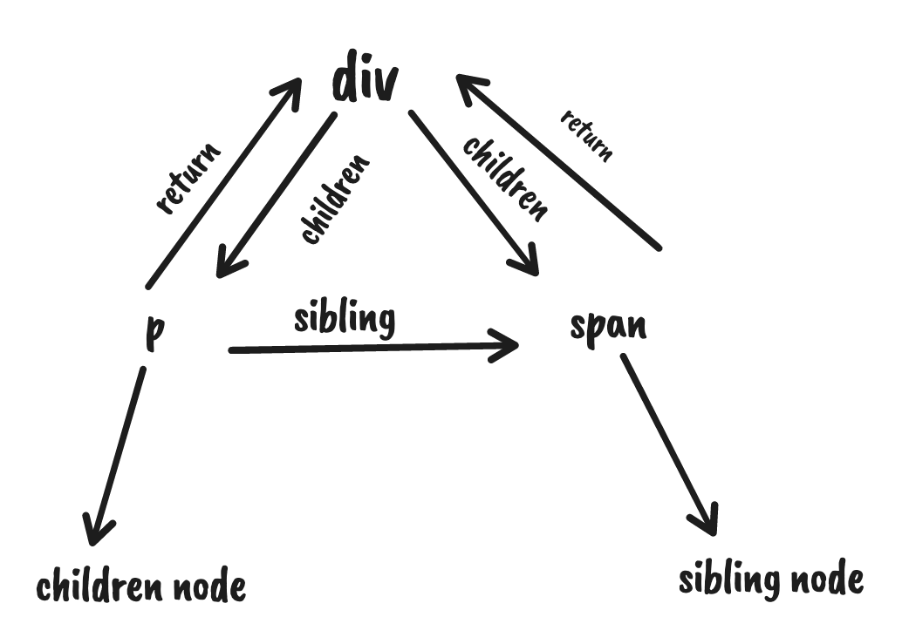

## React 原理的理解？

**vdom**

首先它是一个响应式框架，采用的 vdom，如果采用 dom api 对真实的 dom 增删改，已经有一个渲染好的 dom，后来要更新，那么就要便利它的所有属性，重新设置。比如 id，onclick，class等等。

dom 的属性还是比较多的，大部分我们基本用不到，但是需要重新更新设置一遍，很没必要。

因此也就是为什么需要 vdom 的原因之一了。

而且有了 vdom 之后，不需要强绑定，还可以渲染其他平台（跨端），如native，canvas等等。

vdom 对象结构如下：

```jsx
{
	type: 'div',
	props: {
		id: 'aaa'
		className: ['bbbb', 'ccc'],
		onClick: function() {}
	},
	children: [ ... ]
}
```

## **dsl编译**

react 的 jsx 是 babel 编译实现的，vue 的 template compiler

编译成 render function 后再执行就是我们需要的 vdom

接下来就是渲染vdom了

## **渲染 vdom**

渲染 vdom 也是通过 dom api 增删改 dom

比如一个 div，那就要 document.createElement 创建元素，然后 setAttribute 设置属性，addEventListener 设置事件监听器。

如果是文本，那就要 document.createTextNode 来创建。

不管 vue 还是 react，渲染器里这段 if else 是少不了的：

```jsx
switch (vdom.tag) {
  case HostComponent:
    // 创建或更新 dom
  case HostText:
    // 创建或更新 dom
  case FunctionComponent: 
    // 创建或更新 dom
  case ClassComponent: 
    // 创建或更新 dom
}
```

react 是通过 tag 来区分 vdom 类型，比如 HostCompoent 是元素， HostText 是文本，FunctionComponent 是函数组件，ClassComponent 是类组件。

## **组件**

react 各个组件类型拿到 vdom，调用 render 函数渲染。

vue 通过 option 对象中的 render 方法渲染。（render 也是和 jsx 的形式）

vue 和 react vdom 渲染流程都差不多，区别大的地方就是管理状态方式不一样，vue 有响应式，react 有 setState api 更新。

## **状态管理**

react 是通过 setState api 来触发更新的，更新以后渲染整个 dom

vue 有响应式代理，不管是父组件，子组件还是其他位置组件，只要用到了对应的状态，那么就会被依赖收集，状态变化的时候就可以出发它们的 render，不管组件在哪里。

## **react 架构演变**

早在 react15 版本，还是和 vue 比较像的，都是递归渲染 dom，增删改 dom

但是因为架构的差异，逐渐不同，

react 使用 setState api 形式更新 dom，意味着，一个应用 dom 过大，计算可能较大

浏览器里 js 计算时间较长会阻塞渲染，会占用每一帧重绘，重排，动画的时间，这样动画就很会卡顿。

所以能不能把计算量拆分一下， 每一帧拆成计算一部分，不要阻塞动画的渲染（也就是下面说的调度（schedule））

因此 fiber 由此诞生。

### **fiber 架构**

现在优化的目标是计算部分，但是递归渲染不是可打断的，由下面原因导致：

- 渲染的时候操作 dom，这时候打断了，那么已经更新的 dom 那部分怎么办？
- 现在是直接渲染 dom，如果打断了，子节点如何找到父节点 ？

**第一个问题**解决思路，渲染的时候不直接更新 dom，找到变化的部分，打上增删改标记，完成全部计算之后再一次性更新 dom

所以可以把渲染流程分为：render 和 commit 阶段

找到变化的部分，打上增删改标记，这个阶段的操作叫调和（reconcile）。这个阶段是可以打断，能够去执行优先级高的部分，之后由 schedule 部分调用，继续执行调和，循环反复直到执行完毕，

最后一次性更新 dom，这个叫做 commit 阶段，准备就绪，渲染 dom。

**第二个问题**如何记录父子节点，兄弟节点呢？

光靠vdom里面的信息还是不够的，还需要添加子节点 return 指向父节点，父节点 children 指向子节点，ssibling 指向兄弟节点：

```jsx
<div>
	<p>子节点</p>
	<span>兄弟节点</span>
</div>
```



这种数据结构也叫做 fiber，额外多了 sibling、return，分别记录着兄弟节点、父节点的信息。

为什么这样就可以打断了呢？

因为现在不再是递归，而是循环了：

```jsx

function workLoop() {
  while (wip) {
    performUnitOfWork();
  }

  if (!wip && wipRoot) {
    commitRoot();
  }
}
```

workLoop 函数里面就是干正经事了，循环，wip 节点，里面就是形成 fiber 结构，进行 reconcile，当前处理的 fiber 会放在 workInProgress 这个属性里面保存。

看看 performUnitOfWork 干了啥：

```jsx
function performUnitOfWork() {
  const { tag } = wip;

  switch (tag) {
    case HostComponent:
      updateHostComponent(wip);
      break;

    case FunctionComponent:
      updateFunctionComponent(wip);
      break;

    case ClassComponent:
      updateClassComponent(wip);
      break;
    case Fragment:
      updateFragmentComponent(wip);
      break;
    case HostText:
      updateHostTextComponent(wip);
      break;
    default:
      break;
  }

  if (wip.child) {
    wip = wip.child;
    return;
  }

  let next = wip;

  while (next) {
    if (next.sibling) {
      wip = next.sibling;
      return;
    }
    next = next.return;
  }

  wip = null;
}
```

每个fiber 根据不同的类型 reconclie，处理完当前的fiber 节点，会转到 sibling 兄弟节点处理，最后处理完毕后，再 return 回去父节点。

在这过程中循环之前还需要处理一下高优先级的任务，也就是 reconcile 之前需要调用一下 shouldYield 方法：

```jsx
function workLoop() {
  while (wip && shouldYield()) {
    performUnitOfWork();
  }

  if (!wip && wipRoot) {
    commitRoot();
  }
}
```

这就是 fiber 架构的 reconcile 可以打断的原理。通过 fiber 的数据结构，加上循环处理前每次判断下是否打断来实现的。

接下来就是 commit 阶段。

为了变为可打断的，reconcile 阶段并不会真正操作 dom，只会创建 dom 然后打个 effectTag 的增删改标记。

在 reconcile 的时候把有 effectTag 的节点收集到一个队列里，然后 commit 阶段直接遍历这个队列就行了。

react 会在 commit 阶段遍历 effectList，根据 effectTag 来增删改 dom。

dom 创建前后就是 useEffect、useLayoutEffect 还有一些函数组件的生命周期函数执行的时候。

实际上 react 把 commit 阶段也分成了 3 个小阶段。

before mutation、mutation、layout。

mutation 就是遍历 effectList 来更新 dom 的。

它的之前就是 before mutation，会异步调度 useEffect 的回调函数。

它之后就是 layout 阶段了，因为这个阶段已经可以拿到布局信息了，会同步调用 useLayoutEffect 的回调函数。而且这个阶段可以拿到新的 dom 节点，还会更新下 ref。

## 总结

vue 和 react 都是 vdom 转换为 jsx。

react 是 babel 编译的，vue 是 template compiler 自己是实现的。

vue 是响应式更新，用到了对应的状态，就会依赖收集，从而更新到对应组件。

react 通过 setState api 更新，递归渲染 dom。

因此有了 fiber 架构。

fiber 架构中，为了解决大型应用递归带来的比较大计算，会造成浏览器渲染阻塞，将计算拆分出来。

整个阶段可以分为 render + commit 阶段

render 阶段，会进行 reconcile 调和，以及对增删改变化的部分打上标记，effectTag，并统一放到 effectsList 里面。

中间调和过程中判断是否高优先级任务，有的话先打断，去直接优先级高的，也就是让去位置给浏览器渲染，执行完毕调度 schedule 继续执行调和

等调和完毕之后一次性更新 dom。

后面就是渲染阶段了，执行 effect 。